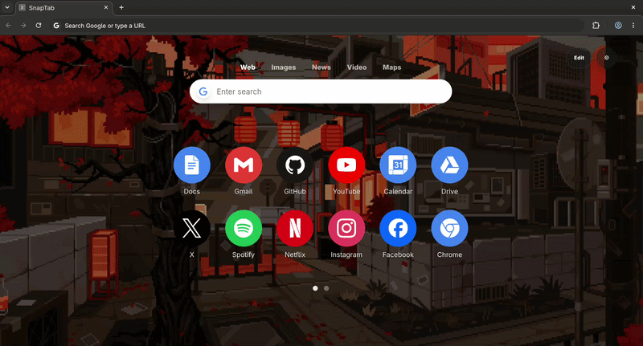

<div align="center">

# SnapTab

SnapTab is a local-first Chrome new tab extension for building a personalized, fast, and portable browser start surface.



[](https://developer.chrome.com/docs/extensions/develop/migrate/what-is-mv3)
[](https://react.dev/)
[](https://www.typescriptlang.org/)
[](https://vitejs.dev/)
[](https://zustand-demo.pmnd.rs/)
[](https://vitest.dev/)
[](https://playwright.dev/)

</div>

---

## Overview

SnapTab replaces Chrome's new tab page with a customizable workspace. It combines search, shortcuts, folders, weather, date/time, Snap Feed RSS, wallpaper controls, and backup tools in a single Manifest V3 extension.

The app is shaped by familiar new tab productivity patterns, but it is its own implementation and product direction.

## Features

- Chrome Manifest V3 new tab override
- Full-viewport Canvas with movable and resizable widgets
- Search widget with configurable search providers and display options
- Shortcut Grid widget with paged top-level tiles
- Weather widget with location, units, display, and refresh controls
- Date & Time widget with clock/date display modes and color controls
- Snap Feed widget for RSS/Atom feeds with direct extension fetch, OPML import/export, feed checks, thumbnails, refresh, and per-feed item limits
- Shortcut add, edit, delete, reorder, and drag behavior
- Toolbar popup for saving the current active website as a shortcut
- Folder creation by dragging shortcuts together
- Folder edit, delete, child reorder, and drag-out promotion flows
- Cross-page tile drag using page-edge hover navigation
- User-uploaded wallpapers, including static images and GIFs
- Wallpaper dim and blur controls
- Shortcut icons from brand matches, uploaded images, or generated fallback labels
- Settings drawer for search, grid, wallpaper, and backup controls
- JSON backup export and replace-only import
- Local-first persistence through Chrome storage
- RSS feed fetching through a Manifest V3 background service worker with default host permissions for `http` and `https` feeds
- Reduced motion support

## Technology

- React 19
- TypeScript
- Vite
- Chrome Extension Manifest V3
- Zustand for state management
- Immer for immutable store updates
- Motion for animation with reduced motion support
- Simple Icons for brand icon matching
- Vitest for unit tests
- Playwright for browser smoke tests

## Development

For implementation details and current architecture notes, see [docs/development.md](docs/development.md), [docs/hld.md](docs/hld.md), and [docs/lld-drag-drop.md](docs/lld-drag-drop.md).

Install dependencies:

```bash
npm install
```

Run the development server:

```bash
npm run dev
```

Open:

```text
http://localhost:5173/
```

Run unit tests:

```bash
npm test
```

Run the browser smoke test:

```bash
npm run test:smoke
```

## Load In Chrome

Build the extension:

```bash
npm run build
```

Then:

1. Open `chrome://extensions/`
2. Enable **Developer mode**
3. Click **Load unpacked**
4. Select the `dist/` directory

After each new build, click the extension card's reload button in `chrome://extensions/`.

## Backup And Persistence

SnapTab is local-first. There is no backend account or sync service in the current app.

Runtime state is persisted to `chrome.storage.local`, with a localStorage fallback for development. Backups are portable JSON files that replace the current state on import.

Uploaded wallpapers and shortcut icons are kept portable as data URLs or media-backed records in the local extension environment.

Snap Feed subscriptions are stored in the same local state and are included in JSON backups. OPML import/export is scoped to Snap Feed subscriptions only. Feed article caches remain runtime cache data and are not mixed into user feed configuration.

The extension manifest includes broad `http`/`https` host permissions so the background service worker can fetch common RSS/Atom feeds that do not expose browser CORS headers. Test Snap Feed from the installed `chrome-extension://.../newtab.html` page; Vite dev pages still run as normal web origins.

## Project Docs

- [Development notes](docs/development.md)
- [High-level design](docs/hld.md)
- [Drag-and-drop low-level design](docs/lld-drag-drop.md)
- [Architecture review](docs/architecture-review.md)
- [Roadmap issues](docs/roadmap-issues.md)

## Releases

Releases are manual. When you intentionally want a new version:

1. Merge the release-ready changes to `main`.
2. Run the `Release` workflow from GitHub Actions on `main`.

The workflow checks out `main`, auto-advances the release version if the current tag already exists, syncs `package.json` and `public/manifest.json` for the build, generates release notes from commits since the previous tag, and attaches a zipped `dist/` package to the release.
